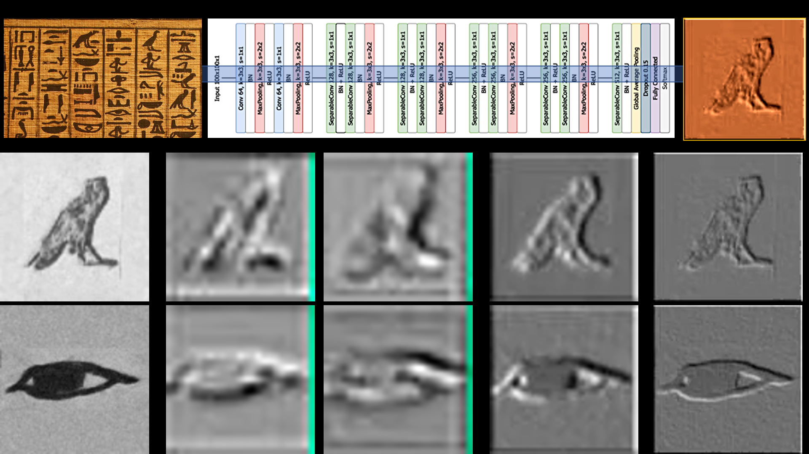

# Glyphnet

*Glyphnet* is a repository that includes an example of a deep learning approach to ancient Egyptian hieroglyphs classification.

If you use this repository, please cite it as:

A. Barucci, C. Cucci, M. Franci, M. Loschiavo and F. Argenti, **A Deep Learning Approach to Ancient Egyptian Hieroglyphs Classification**. IEEE Access, vol. 9, pp. 123438-123447, 2021, doi: 10.1109/ACCESS.2021.3110082, [IEEE DIRECT LINK](https://ieeexplore.ieee.org/stamp/stamp.jsp?tp=&arnumber=9528382&isnumber=9312710)

@ARTICLE{9528382,  author={Barucci, Andrea and Cucci, Costanza and Franci, Massimiliano and Loschiavo, Marco and Argenti, Fabrizio},  journal={IEEE Access},   title={A Deep Learning Approach to Ancient Egyptian Hieroglyphs Classification},   year={2021},  volume={9},  number={},  pages={123438-123447},  doi={10.1109/ACCESS.2021.3110082}}

This document provides a quick introduction to the *glyphnet.ipynb* notebook to help new users get started. In addition to the source code, we also provide a [link](https://en.wikipedia.org/wiki/Pyramid_of_Unas) to the dataset containing 4210 manually annotated images of Egyptian hieroglyphs found in the Pyramid of Unas. The dataset can be dowloaded [here](http://iamai.nl/downloads/GlyphDataset.zip).

Authors wishes to express their gratitute for the [seminal work of Franken](https://github.com/morrisfranken/glyphreader).


Please read the [LICENSE.md](./LICENSE.md) file before using *Glyphnet*.

## Abstract
Nowadays, advances in Artificial Intelligence (AI), especially in machine and deep learning, present new opportunities to build tools that support the work of specialists in areas apparently far from the information technology field. One example of such areas is that of ancient Egyptian hieroglyphic writing. In this study, we explore the ability of different convolutional neural networks (CNNs) to classify pictures of ancient Egyptian hieroglyphs coming from two different datasets of images. Three well-known CNN architectures (ResNet-50, Inception-v3 and Xception) were taken into consideration and trained on the available images. The paradigm of transfer learning was tested as well. In addition, modifying the architecture of one of the previous networks, we developed a specifically dedicated CNN, named Glyphnet, tailoring its complexity to our classification task. Performance comparison tests were carried out and Glyphnet showed the best performances with respect to the other CNNs. In conclusion, this work shows how the ancient Egyptian hieroglyphs identification task can be supported by the deep learning paradigm, laying the foundation for information tools supporting automatic documents recognition, classification and, most importantly, the language translation task.




## Requirements
Open a terminal window (for Unix users) or Anaconda Prompt (for Windows users), activate or create a Python environment with Python version 3.9.1 installed (we recommend to create a new Python environment, see below) and install the following Python packages (if packages already exist, check the version)

```
pip install mlxtend==0.18.0
pip install matplotlib==3.3.3
pip install pandas==1.2.0
pip install numpy==1.19.5
pip install openpyxl==3.0.5
pip install scikit-learn==0.24.0
pip install tensorflow==2.7.0
pip install statistics==1.0.3.5
pip install scipy==1.7.3
```

### Create a new Python virtual environment using conda and the requirements.txt file:

- [Install](https://docs.conda.io/projects/conda/en/latest/user-guide/install/index.html) Anaconda
- Create a new virtual environment with Python 3.9.1 and the libraries listed in the [requirements.txt](https://github.com/GAIA-IFAC-CNR/Glyphnet/blob/main/requirements.txt) file
```
conda create --name myenv --file requirements.txt
```
where *myenv* is the new virtual environment name.


## Usage

About the notebooks:
- [glyphnet.ipynb](https://github.com/GAIA-IFAC-CNR/Glyphnet/blob/main/glyphnet.ipynb) is the main code. Here you will be able to load your dataset for test purposes and to make predictions using the [weights](https://github.com/GAIA-IFAC-CNR/Glyphnet/blob/main/weights.hdf5) of our model. Please remember that this version of Glyphnet works on images with resolution 100x100 and in .jpg format (also other formats should work but we didn't tested them yet).
Make sure that your dataset matches the labels we used that are listed as *allowed_labels* in the [utils](https://github.com/GAIA-IFAC-CNR/Glyphnet/blob/main/utils.ipynb) notebook. You should save your images as filename_LABEL.jpg, where LABEL is the Gardiner code (all caps)(e.g. the file 00001_D2.jpg will be accepted by Glyphnet and treated as an example of D2 glyph).
To use the code you simply need to specify the path to your dataset folder, including all the .jpg files (also store in subfolders).
- [utils.ipynb](https://github.com/GAIA-IFAC-CNR/Glyphnet/blob/main/utils.ipynb) holds a set of useful functions that will be used along the entire code, e.g. to load the dataset, to plot the loss over training, the architecture of glyphnet, the list of allowed labels etc.


## Ouputs
After the prediction, you will get some meaningful metrics, such as accuracy, precision, recall, f1 score. Moreover you will get also a summary of the performances class by class, thanks to the get_prediction_data function. A detailed guide for its use and on how to choose the parameters you need to pass it can be found in the [utils](https://github.com/GAIA-IFAC-CNR/Glyphnet/blob/main/utils.ipynb) notebook.

## Authors
* **Andrea Barucci, MSc, PhD** - *Researcher at the Institute of Applied Physics "Nello Carrara" (IFAC) – National Council of Research (CNR), Sesto Fiorentino, Italy.* Email address: <a.barucci@ifac.cnr.it>
* **Fabrizio Argenti, MSc, PhD** - *Associate Professor at the Department of Information Engineering (DINFO), University of Florence, Florence, Italy*. Email address: <fabrizio.argenti@unifi.it>
* **Tommaso Guidi, BSc** - *Master Degree student in Artificial Intelligence and Automation Engineering - Department of Information engineering and mathematics, University of Siena, Siena, Italy. Email address: <t.guidi@student.unisi.it>
* **Chiara Marzi, MSc, PhD** - *Postdoctoral Research Fellow at the Institute of Applied Physics "Nello Carrara" (IFAC) – National Council of Research (CNR), Sesto Fiorentino, Italy.* Email address: <c.marzi@ifac.cnr.it>
* Lorenzo
